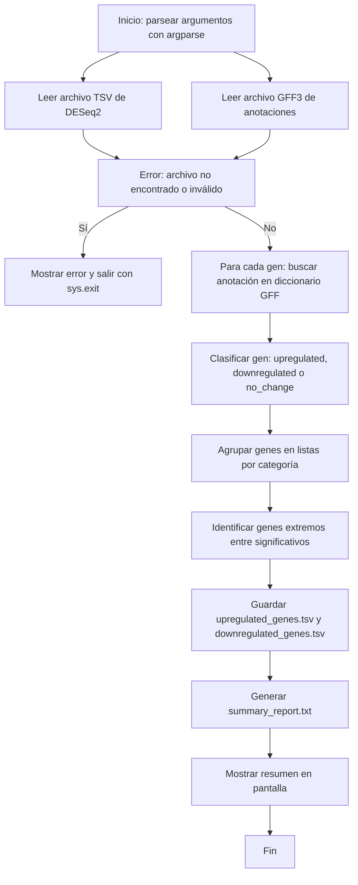

# Diagrama de flujo del análisis DESeq2

```mermaid
flowchart TD
    A[Inicio: parsear argumentos con argparse] --> B[Leer archivo TSV de DESeq2]
    A --> C[Leer archivo GFF3 de anotaciones]
    B --> D[Error: archivo no encontrado o inválido]
    C --> D
    D -->|Sí| E[Mostrar error y salir con sys.exit]
    D -->|No| F[Para cada gen: buscar anotación en diccionario GFF]
    F --> G[Clasificar gen: upregulated, downregulated o no_change]
    G --> H[Agrupar genes en listas por categoría]
    H --> I[Identificar genes extremos entre significativos]
    I --> J[Guardar upregulated_genes.tsv y downregulated_genes.tsv]
    J --> K[Generar summary_report.txt]
    K --> L[Mostrar resumen en pantalla]
    L --> M[Fin]
```